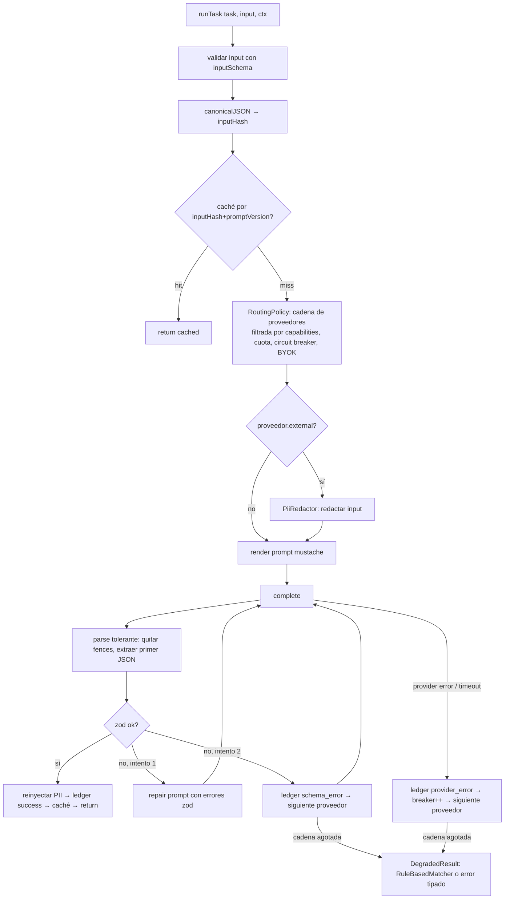
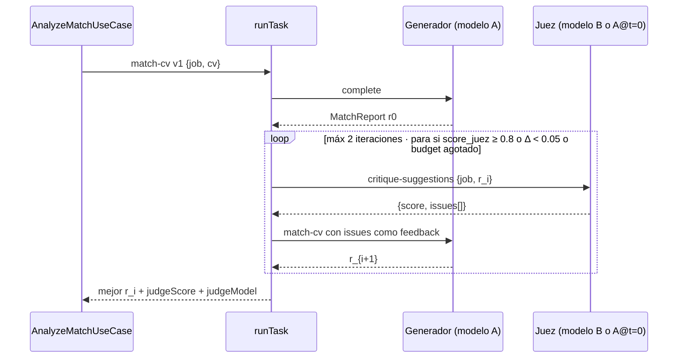
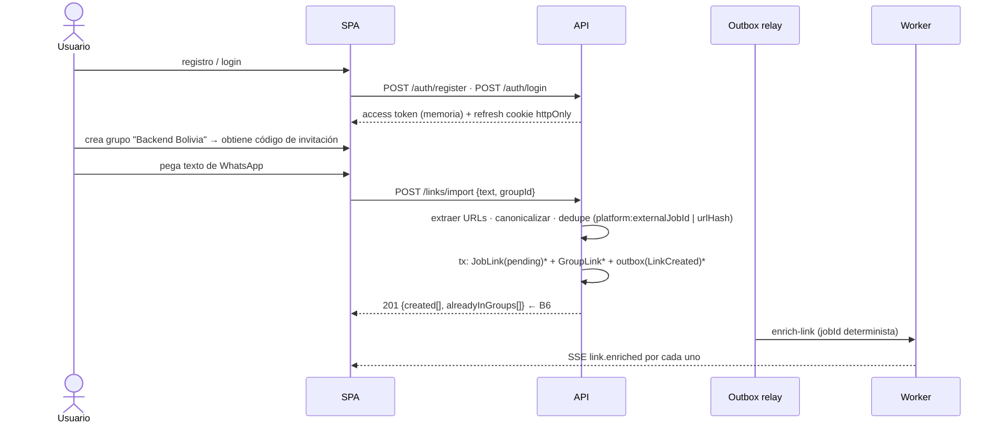

# LinkVault — Revisión pre-implementación
## Debate Critic ↔ Business con Reflect · Flujos · Módulo de integración IA

> Versión 0.2 · Complementa a `docs/design.md` (v0.1). Las decisiones aquí **sustituyen** a las de v0.1 donde se indique.

---

## 1. Protocolo de la sesión

**Agentes**

| Agente | Mandato | Criterio de veto |
|---|---|---|
| 🧪 **Critic** (senior técnico) | Encontrar debilidades de diseño, riesgos operativos, deuda temprana, ambigüedades que Claude Code resolvería "a su manera" | Puede marcar **P0** (bloquea implementación) o **P1** (debe resolverse en el change correspondiente) |
| 💼 **Business** (producto) | Alinear features al problema real (no perder links, saber en qué proceso está cada quien, mejorar empleabilidad), priorizar por valor/esfuerzo, detectar features que nadie usaría | Puede marcar **V0** (sin esto el MVP no vale) o **V1** |
| 🪞 **Reflect** (moderador) | Confrontar Critic vs Business, decidir *aceptado / adaptado / diferido / rechazado*, actualizar el diseño y declarar convergencia | Converge cuando **no queda ningún P0/V0 abierto** y ambos agentes firman |

**Ciclo:** Critic propone → Business propone → Reflect cruza ambas listas → diseño v(n+1) → los agentes re-evalúan solo lo cambiado → repetir. Se logró convergencia en **3 iteraciones**.

---

## 2. Iteración 1

### 2.1 🧪 Critic — hallazgos técnicos

| # | Sev | Hallazgo | Fundamento senior | Propuesta |
|---|---|---|---|---|
| C1 | P0 | **Dedupe por URL normalizada es insuficiente.** LinkedIn expone el mismo job como `/jobs/view/123`, `?currentJobId=123`, `/comm/jobs/view/123`; Computrabajo agrega slugs variables. | Una clave de dedupe frágil rompe la promesa central del producto ("un link, N postulaciones"). | `Canonicalizer` por plataforma que produce `{platform, externalJobId}`; clave de dedupe = `platform:externalJobId` si existe, si no `urlHash`. Índice único parcial en Mongo. |
| C2 | P0 | **Pérdida de jobs entre API y worker.** Crear `JobLink` y encolar en BullMQ son dos escrituras sin atomicidad. | Ante un fallo de Redis, quedan links `pending` para siempre. Clásico dual-write. | **Outbox pattern**: el caso de uso escribe `JobLink` + `outbox_events` en una transacción Mongo; un relay publica a BullMQ. Requiere Mongo como **replica set de un nodo** en compose. Jobs con `jobId` determinista (`enrich:{linkId}:{v}`) para idempotencia. |
| C3 | P1 | **Preview compartido vs edición manual.** Si un miembro edita el preview canónico y luego el worker re-enriquece, se pisa la edición. | Última-escritura-gana sin procedencia = datos corruptos silenciosos. | Procedencia **por campo**: `preview.fields.title = {value, source: auto\|manual, by, at, confidence}`. El merge automático nunca sobrescribe `manual`. |
| C4 | P0 | **Salida de LLM validada con zod, pero sin estrategia de reparación ni fallback.** | Con modelos gratuitos la tasa de JSON inválido puede superar 15 %. Reintentar ciego duplica costo/latencia. | `StructuredOutputPipeline`: parse tolerante → validar → *repair prompt* (1 vez, con el error de zod) → siguiente proveedor de la cadena → mock/degradado. Métrica `schema_validity_rate` por modelo. |
| C5 | P1 | **Mock determinista por hash del prompt es frágil.** Cualquier cambio de un espacio en el prompt invalida todos los fixtures. | El mock existe para que CI sea estable; si se rompe con cada retoque, se lo desactiva y se pierde. | Clave = `sha256(taskName + promptVersion + canonicalJSON(input))`, **no** el texto del prompt. Dos modos: `replay` (fixture) y `synth` (generador guiado por el schema zod con PRNG sembrado por la clave). Modo `record` para capturar fixtures desde un proveedor real. |
| C6 | P0 | **No hay forma de saber si cambiar de modelo empeora el producto.** | Sin *golden set* ni métricas, "extender a modelos frontera" es un salto de fe. | **Eval harness** en repo: `evals/<task>/golden.jsonl`, corredor `pnpm eval --task=extract-job --provider=X`, métricas por tarea (validez de schema, recall de skills, exactitud de campos). Corre en CI con mock; manual con proveedores reales. |
| C7 | P1 | **Sin contabilidad de tokens/costo ni cuotas.** | Un usuario con 40 links y 3 CVs puede quemar el free tier en una tarde. | `AiUsageLedger` (usuario, tarea, proveedor, tokens in/out, costo estimado, latencia). Cuotas por plan y por tarea. Circuit breaker por proveedor. |
| C8 | P0 | **CV a proveedores externos.** El consentimiento está previsto, pero nada impide que el texto viaje con nombre, teléfono, dirección. | Dato personal sensible + tercero = riesgo legal y de confianza. | `PiiRedactor` antes de cualquier proveedor `external`: reemplaza email/teléfono/URLs/dirección por tokens estables (`[EMAIL_1]`) y los reinyecta en la salida. Nunca se persiste el prompt crudo. |
| C9 | P1 | **Angular SSR solo para `/p/:slug` añade un runtime más.** | SSR completo por una sola página pública es costo desproporcionado. | La **API** sirve `/p/:slug`: HTML mínimo con OG tags para bots + `<meta http-equiv="refresh">`/JS redirect a la SPA para humanos. Sin SSR en MVP. |
| C10 | P1 | **pnpm workspaces sin orquestador.** | Sin grafo de tareas ni caché, `test:affected` del hook no existe; CI corre todo siempre. | **Nx** (generadores oficiales para Nest y Angular, `nx affected`, caché). Alternativa ligera: Turborepo. |
| C11 | P1 | **Auth JWT en localStorage.** | XSS = robo de sesión. | Access token en memoria, refresh token en cookie `httpOnly; SameSite=Lax` con **rotación** y detección de reuso. Argon2id para passwords. |
| C12 | P1 | **Extractores sin cortesía por dominio.** | Ráfagas contra un mismo host = bloqueo de IP y daño reputacional. | Cola por dominio con `limiter` de BullMQ (p. ej. 1 req/2 s por host), caché de `robots.txt`, `User-Agent` identificable con URL de contacto. |
| C13 | P1 | **Eventos de dominio in-process sin contrato.** | El worker y la API acabarán acoplados a shapes implícitos. | `packages/shared/events/*.ts`: eventos de integración versionados (`LinkEnriched.v1`). EventEmitter2 dentro del proceso; BullMQ cuando cruza procesos. |
| C14 | P1 | **Evaluator–optimizer sin límite ni criterio de parada explícito.** | Loops agénticos sin *budget* son la forma más rápida de gastar dinero sin mejora. | Máx. 2 iteraciones, parada temprana si el evaluador da ≥ 0.8 o si la mejora < 0.05, budget de tokens por ejecución. |

### 2.2 💼 Business — mejoras de producto

| # | Val | Propuesta | Por qué |
|---|---|---|---|
| B1 | V0 | **Importar pegando el chat de WhatsApp** (texto plano con varias URLs) como primer paso del onboarding. | Es exactamente el dolor de origen; convierte el histórico perdido en repositorio en 30 segundos. |
| B2 | V0 | **Estado privado por defecto**, compartir estado con el grupo es opt-in por postulación. | Postular es íntimo; si la gente teme que el grupo vea "rechazado", no registra nada. Resuelve G1. |
| B3 | V0 | **Comentarios cortos por link dentro del grupo** ("piden inglés C1", "ya cerró"). | El valor del grupo es el contexto humano; sin esto el grupo es una carpeta. |
| B4 | V1 | **Alerta de seguimiento**: "postulaste hace 10 días sin cambio de estado". | Convierte el tracker en un asistente; ayuda a no dejar procesos muertos. |
| B5 | V1 | **Badge de fit** (0–100) en la card cuando el usuario tiene CV cargado. | Ordena la bandeja por dónde vale la pena postular. Da razón de existir al módulo de CV en el día a día. |
| B6 | V1 | **"Este link ya está en Grupo X"** al guardar. | Evita duplicados humanos y conecta grupos. |
| B7 | V1 | **BYOK** (*bring your own key*): el usuario puede pegar su API key de Anthropic/OpenAI/OpenRouter. | Modelos frontera sin costo para la plataforma; el usuario avanzado ya tiene claves. Complementa el free tier. |
| B8 | V1 | **Página pública `/p/:slug` como puerta de entrada**: quien recibe el link por WhatsApp ve el preview sin cuenta + CTA "Guardar en LinkVault". | Adquisición orgánica: cada link compartido es una invitación. |
| B9 | V1 | **Normalización de salario y modalidad** (Bs/USD, remoto/híbrido/presencial, ciudad). | Los filtros que la gente realmente usa en LatAm. |
| B10 | V2 | Digest semanal por email del grupo. | Retención; depende de notificaciones (F2). |
| B11 | V2 | Flag "conozco a alguien ahí" en el link del grupo. | Referidos son el canal con mejor conversión. |
| B12 | ✗ | Generar cover letters con IA. | Riesgo de spam y de homogeneizar candidatos; fuera de alcance. |

### 2.3 🪞 Reflect 1 — cruce y decisiones

| Ítem | Decisión | Nota |
|---|---|---|
| C1, C2, C4, C6, C8 | **Aceptado** (P0) | Entran en `bootstrap`/`ai-gateway`/`job-links`. |
| C3 | **Aceptado** | Procedencia por campo. Business añade: el editor manual ve qué campos vinieron de IA. |
| C5 | **Aceptado** | Los tres modos del mock quedan en el diseño del módulo IA (§4). |
| C7 + B7 | **Fusionado** | Ledger + cuotas por plan; BYOK cuenta contra la cuota del usuario **cero** (su costo). Critic pide: claves cifradas con libsodium, nunca en logs, revocables. Aceptado. |
| C9 + B8 | **Fusionado** | La API sirve `/p/:slug` con OG; el CTA "Guardar en LinkVault" lleva a la SPA con `?import=<slug>`. |
| C10 | **Aceptado con reserva** | Nx. Business no opina; Critic firma. Se documenta cómo salir a Turborepo si Nx pesa. |
| C11, C12, C13, C14 | **Aceptado** | |
| B1 | **Aceptado, sube al MVP** | Parser de URLs + detección de plataforma; cada URL → `JobLink` pending. |
| B2 | **Aceptado**, cierra G1 | `Application.visibility` default `private`. |
| B3 | **Adaptado** | Critic objeta *scope creep*. Reflect: comentarios **planos** (texto, autor, fecha), sin hilos ni reacciones. `GroupLinkComment`. |
| B4 | **Diferido a F2** | Necesita notificaciones. Se deja el evento `ApplicationStale` diseñado. |
| B5 | **Aceptado en F2** (`cv-match-suggestions`) | `Application.fitScore` / `fitScoreDegraded` se **derivan al leer** del último análisis; nadie los escribe (ADR-030 §5). |
| B6 | **Aceptado en MVP** | Es una consulta barata sobre `group_links` por `linkId`. |
| B9 | **Aceptado en MVP** | El schema `JobPreview` incluye `salary{min,max,currency,period}` y `modality`. |
| B10, B11 | **Diferidos** | F2/F3. |
| B12 | **Rechazado** | Ambos agentes de acuerdo. |

**Abiertos tras iteración 1:** ninguno P0/V0. Quedan P1 de detalle sobre el módulo IA (§4) → iteración 2.

---

## 3. Iteración 2 y 3 — foco en el módulo IA

### 3.1 🧪 Critic sobre el diseño IA propuesto en §4 (borrador)
- **C15 (P1):** "Routing por tarea" está bien, pero falta distinguir **capacidad** de **política**: no todo proveedor soporta JSON mode, tool use o contexto largo. → Cada adaptador declara `capabilities`; la política de routing filtra por capacidades antes de elegir.
- **C16 (P1):** Prompts en Markdown con front-matter: ¿cómo se inyectan variables sin romper el determinismo? → Plantillas con **Mustache** (sin lógica), variables tipadas por zod (`inputSchema`), y `canonicalJSON(input)` para el hash.
- **C17 (P1):** Streaming: la UI querrá ver las sugerencias de CV en tiempo real, pero salidas estructuradas + streaming es incómodo. → MVP **sin** streaming para tareas estructuradas; el paso alcanzado se **guarda con el análisis** y se **devuelve al consultarlo** (sondeo; ADR-030 §9). El aviso en vivo por SSE `analysis.step` se difiere a `cv-suggestions-review`. Streaming de texto libre solo en F3.
- **C18 (P1):** Embeddings: se listó `EmbeddingProvider` pero ninguna tarea del MVP los usa. → **Se elimina del MVP** (YAGNI). Se reintroduce en F2 para búsqueda semántica y caché semántico.
- **C19 (P1):** El evaluador de CV usando **el mismo modelo** que el generador sesga la crítica. → Política: el evaluador usa otro modelo si hay ≥ 2 disponibles; si no, mismo modelo con temperatura 0 y prompt adversarial. Registrar `judgeModel`.

### 3.2 💼 Business sobre el módulo IA
- **B13 (V1):** El usuario debe **ver por qué** la IA sugiere algo (rationale ligado a un requisito del aviso). → `Suggestion.evidence: {jobRequirement, cvFragment?}` obligatorio en el schema.
- **B14 (V1):** Botón **"no me convence"** por sugerencia → feedback que alimenta el golden set. → `ai_feedback` colección; el harness puede exportarlo a `golden.jsonl` con revisión humana.
- **B15 (V0):** Cuando no hay proveedor disponible (cuota agotada, sin red), el producto **no debe verse roto**. → Modo degradado explícito en UI: "Análisis en cola / análisis básico por reglas". El mock en modo `synth` **no** se usa en producción; en su lugar un `RuleBasedMatcher` (intersección de skills por diccionario) da un resultado honesto.
- **B16 (V1):** Español como idioma de salida por defecto, aunque la vacante esté en inglés; el usuario puede cambiarlo. → `outputLanguage` en el perfil.

### 3.3 🪞 Reflect 2 → 3
Todos los ítems C15–C19 y B13–B16 **aceptados**. En la iteración 3 los agentes re-evaluaron el §4 final: Critic señaló solo una redacción ambigua sobre el ledger (resuelta: se registra también el intento fallido con `outcome: schema_error|provider_error|quota`), Business no tuvo objeciones.

> ✅ **Convergencia declarada.** Firmas: 🧪 Critic · 💼 Business · 🪞 Reflect.

### 3.4 ADRs nuevos / actualizados
| ADR | Decisión |
|---|---|
| ADR-008 | Dedupe por `platform:externalJobId` con fallback `urlHash`; canonicalizadores por plataforma |
| ADR-009 | Outbox pattern Mongo → BullMQ; Mongo en replica set de 1 nodo en todos los entornos |
| ADR-010 | Procedencia por campo en `JobPreview`; `manual` domina sobre `auto` |
| ADR-011 | Nx como orquestador del monorepo |
| ADR-012 | Auth: access token en memoria + refresh cookie httpOnly con rotación; Argon2id |
| ADR-013 | `/p/:slug` servido por la API (OG para bots, redirect a SPA); sin SSR en MVP |
| ADR-014 | Módulo IA: routing por capacidades, structured-output pipeline con repair, mock de 3 modos, ledger+cuotas, PII redaction, eval harness, BYOK cifrado, degradación a reglas |
| ADR-015 | Visibilidad de postulación `private` por defecto; comentarios planos por link en grupo |
| ADR-016 | Sin embeddings ni streaming estructurado en MVP |

---

## 4. Módulo de integración IA — diseño detallado

### 4.1 Ubicación y límites
Es un **bounded context** propio (`ai`) implementado como librería Nx compartida por API y worker, con su propio módulo Nest. **Nadie** fuera del módulo importa un SDK de proveedor.

```
libs/ai/
├── domain/
│   ├── ports/
│   │   ├── llm-provider.port.ts        # LlmProvider, ProviderCapabilities
│   │   ├── prompt-registry.port.ts
│   │   ├── usage-ledger.port.ts
│   │   └── secret-vault.port.ts        # BYOK
│   ├── task.ts                         # AiTask<I,O>: name, version, inputSchema, outputSchema
│   ├── routing-policy.ts               # reglas puras (sin IO)
│   └── errors.ts                       # SchemaViolation, ProviderUnavailable, QuotaExceeded
├── application/
│   ├── run-task.usecase.ts             # punto de entrada único: runTask(task, input, ctx)
│   ├── structured-output.pipeline.ts
│   ├── pii-redactor.ts
│   └── evaluator-optimizer.ts          # loop acotado
├── infrastructure/
│   ├── providers/
│   │   ├── mock-deterministic.provider.ts
│   │   ├── ollama.provider.ts
│   │   ├── openrouter.provider.ts
│   │   ├── anthropic.provider.ts
│   │   └── openai.provider.ts
│   ├── provider-registry.ts            # construye la cadena según env + capacidades + BYOK
│   ├── prompts/                        # *.vN.md (front-matter + mustache)
│   ├── fixtures/                       # mock replay: <taskName>/<hash>.json
│   ├── mongo-usage-ledger.ts
│   ├── libsodium-secret-vault.ts
│   └── circuit-breaker.ts
├── evals/
│   ├── extract-job/golden.jsonl
│   ├── match-cv/golden.jsonl
│   └── run-eval.ts
└── ai.module.ts
```

### 4.2 Contratos

```ts
// domain/ports/llm-provider.port.ts
export interface ProviderCapabilities {
  jsonMode: boolean;       // soporta respuesta JSON forzada
  toolUse: boolean;
  maxContextTokens: number;
  external: boolean;       // sale del perímetro (activa PII redaction + consentimiento)
  costPer1kIn: number;     // 0 para mock/ollama
  costPer1kOut: number;
}

export interface CompletionRequest {
  system: string;
  user: string;
  temperature?: number;
  maxTokens?: number;
  responseFormat?: 'text' | 'json';
  signal?: AbortSignal;
}

export interface CompletionResult {
  text: string;
  usage: { inputTokens: number; outputTokens: number };
  model: string;
  latencyMs: number;
}

export interface LlmProvider {
  readonly id: string;                    // 'mock' | 'ollama' | 'openrouter' | 'anthropic' | 'openai' | 'byok:<userId>:<vendor>'
  readonly capabilities: ProviderCapabilities;
  complete(req: CompletionRequest): Promise<CompletionResult>;
  healthy(): Promise<boolean>;
}
```

```ts
// domain/task.ts
export interface AiTask<I, O> {
  name: 'extract-job' | 'match-cv' | 'critique-suggestions' | 'build-roadmap' | 'classify-skills';
  promptVersion: string;                  // 'v1'
  inputSchema: ZodType<I>;
  outputSchema: ZodType<O>;
  requires: Partial<ProviderCapabilities>;// p.ej. { jsonMode: true, maxContextTokens: 16000 }
  temperature: number;                    // tareas estructuradas: 0
  budget: { maxTokens: number; maxAttempts: number };
}
```

### 4.3 `runTask` — el único punto de entrada



Reglas fijas:
- Tareas estructuradas siempre `temperature: 0` y `responseFormat: 'json'` cuando el proveedor lo soporta.
- El *repair prompt* incluye la salida inválida + los `issues` de zod en lenguaje natural; **una** sola vez por proveedor.
- El caché guarda `{output, provider, model, promptVersion}`; se invalida al subir `promptVersion`.
- Ningún prompt renderizado con datos de usuario se persiste; solo hashes y métricas.

### 4.4 Routing por capacidades y política

```ts
// domain/routing-policy.ts (puro)
export function buildChain(task: AiTask<any, any>, ctx: RunContext, all: LlmProvider[]): LlmProvider[] {
  const eligible = all.filter(p =>
    satisfies(p.capabilities, task.requires) &&
    (!p.capabilities.external || ctx.user.aiConsent.externalProviders) &&
    !ctx.breaker.isOpen(p.id) &&
    ctx.quota.allows(ctx.user.id, task.name, p.id));

  // Orden: BYOK del usuario → gratuitos locales → gratuitos remotos → pagos de plataforma
  return sortBy(eligible, p => [
    p.id.startsWith('byok:') ? 0 : 1,
    p.capabilities.costPer1kOut,
    -p.capabilities.maxContextTokens,
  ]);
}
```
Configuración por entorno (`AI_CHAIN=ollama,openrouter,anthropic`) restringe el universo; la política ordena dentro de él. En **test/CI**: `AI_CHAIN=mock`.

### 4.5 Proveedor mock determinista (3 modos)

| Modo | `AI_MOCK_MODE` | Comportamiento |
|---|---|---|
| `replay` | default en CI | Busca `fixtures/<task>/<hash>.json`; si no existe → **falla el test** (obliga a grabar el fixture). |
| `synth` | dev sin red | Genera una salida válida contra `outputSchema` usando un PRNG sembrado con el hash (mismo input → misma salida). Strings se rellenan con tokens del input (p. ej. skills detectadas por diccionario) para que la demo tenga sentido. **Prohibido en producción** (guard en `ai.module.ts`). |
| `record` | manual | Delega en un proveedor real y guarda el resultado como fixture. |

```ts
export class MockDeterministicProvider implements LlmProvider {
  readonly id = 'mock';
  readonly capabilities = { jsonMode: true, toolUse: false, maxContextTokens: 1_000_000, external: false, costPer1kIn: 0, costPer1kOut: 0 };
  async complete(req: CompletionRequest): Promise<CompletionResult> {
    const key = this.keyFrom(req);                  // hash inyectado por runTask en el header del system prompt
    const fixture = await this.fixtures.load(key);
    if (fixture) return fixture;
    if (this.mode === 'synth') return this.synthesize(key, req);
    if (this.mode === 'record') return this.recordFrom(this.upstream, key, req);
    throw new FixtureMissing(key);
  }
}
```

### 4.6 Prompts versionados
```markdown
---
task: match-cv
version: v1
inputSchema: MatchCvInput
outputSchema: MatchReport
outputLanguage: "{{outputLanguage}}"
---
Eres un reclutador técnico senior. Compara el CV con la vacante. Responde SOLO con JSON que cumpla el schema MatchReport.
Cada sugerencia debe citar el requisito del aviso que la motiva (evidence.jobRequirement).
## Vacante
{{job.title}} — {{job.company}}
{{job.description}}
## CV
{{cv.text}}
```
Regla: un cambio de prompt = nuevo archivo `vN+1`, nuevos fixtures y corrida del harness comparando `vN` vs `vN+1`.

### 4.7 Schemas de salida (en `libs/shared`)

```ts
export const JobPreview = z.object({
  title: z.string(), company: z.string().nullable(), location: z.string().nullable(),
  modality: z.enum(['remote','hybrid','onsite','unknown']),
  seniority: z.enum(['intern','junior','mid','senior','lead','unknown']),
  salary: z.object({ min: z.number().nullable(), max: z.number().nullable(), currency: z.string().nullable(), period: z.enum(['month','year','hour']).nullable() }).nullable(),
  skills: z.array(z.object({ name: z.string(), required: z.boolean() })).max(40),
  languages: z.array(z.object({ name: z.string(), level: z.string().nullable() })),
  summary: z.string().max(600),
  postedAt: z.string().date().nullable(), expiresAt: z.string().date().nullable(),
});

export const MatchReport = z.object({
  score: z.number().min(0).max(100),
  matchedSkills: z.array(z.string()), missingSkills: z.array(z.object({ name: z.string(), importance: z.enum(['must','nice']) })),
  suggestions: z.array(z.object({
    section: z.enum(['summary','experience','skills','education','projects','other']),
    before: z.string().nullable(), after: z.string(), rationale: z.string(),
    evidence: z.object({ jobRequirement: z.string(), cvFragment: z.string().nullable() }),
  })).max(12),
});

export const Roadmap = z.object({
  items: z.array(z.object({
    skill: z.string(), priority: z.number().int().min(1).max(5), estimatedWeeks: z.number(),
    resources: z.array(z.object({ type: z.enum(['course','post','book','doc','video']), title: z.string(), url: z.string().url().nullable(), provider: z.string(), free: z.boolean(), verified: z.boolean() })),
  })),
});
```

### 4.8 Evaluator–optimizer acotado (match-cv)



### 4.9 Ledger, cuotas, breaker, BYOK
- `ai_usage`: `{userId, task, providerId, model, inputTokens, outputTokens, estCost, latencyMs, outcome: success|schema_error|provider_error|quota|degraded, promptVersion, at}`.
- Cuotas por plan en `ai_quotas`: p. ej. `free: {match-cv: 10/día, extract-job: 100/día}`; BYOK no consume cuota de plataforma.
- Circuit breaker por proveedor: abre tras 5 fallos/60 s, half-open a los 30 s.
- BYOK: clave cifrada con libsodium `secretbox` y `AI_VAULT_KEY` del servidor; se descifra solo en memoria del worker; revocable desde perfil; nunca en logs (redactor de pino para `apiKey|authorization`).

### 4.10 Privacidad
`PiiRedactor` (regex + diccionario) sobre el CV antes de proveedores `external`: emails, teléfonos (formatos BO/LatAm), URLs personales, direcciones, documento de identidad. Mapa `[EMAIL_1] → valor` vive solo en memoria de la ejecución y se reinyecta en `suggestions[].after`. El nombre propio **se mantiene** salvo que el usuario active `redactName`.

### 4.11 Eval harness
- `libs/ai/evals/<task>/golden.jsonl`: `{input, expected, tags}`; primeras 20 vacantes reales anonimizadas de bolsas bolivianas y LatAm en ES/EN.
- Métricas: `schema_validity_rate`, `field_accuracy` (title/company/modality), `skills_recall`, `skills_precision`, `latency_p50`, `cost_per_run`. Para `match-cv`: correlación del `score` con etiquetas humanas (1–5).
- `pnpm nx run ai:eval --task=extract-job --provider=openrouter` → reporte Markdown en `reports/`. CI ejecuta con `mock/replay` para detectar regresiones de pipeline (no de modelo).
- El feedback de usuarios (`ai_feedback`) se exporta a un `candidates.jsonl` para revisión humana antes de entrar al golden.

### 4.12 Degradación honesta (B15)
Si la cadena se agota: `RuleBasedMatcher` calcula intersección de skills por diccionario (`skills.dictionary.json`, ~600 términos ES/EN con sinónimos) y devuelve `MatchReport` con `degraded: true` y sin `suggestions`. La UI muestra "Análisis básico — el análisis con IA se reintentará".

### 4.13 Spec OpenSpec del change `ai-gateway` (extracto de `specs/ai/spec.md`)
```markdown
## ADDED Requirements
### Requirement: Punto de entrada único
El sistema SHALL exponer `runTask(task, input, ctx)` como única forma de invocar modelos de lenguaje.
#### Scenario: Import directo de SDK fuera de libs/ai
- GIVEN un archivo fuera de `libs/ai/infrastructure/providers`
- WHEN importa `@anthropic-ai/sdk`, `openai` u `ollama`
- THEN el lint (regla eslint `no-restricted-imports`) SHALL fallar

### Requirement: Salida estructurada validada
#### Scenario: JSON inválido en el primer intento
- GIVEN un proveedor que devuelve JSON que no cumple `outputSchema`
- WHEN `runTask` recibe la respuesta
- THEN SHALL enviar exactamente un repair prompt con los errores de validación
- AND si vuelve a fallar SHALL registrar `schema_error` en el ledger y continuar con el siguiente proveedor

### Requirement: Mock determinista
#### Scenario: Mismo input dos veces en modo synth
- GIVEN `AI_MOCK_MODE=synth`
- WHEN se ejecuta la misma tarea con el mismo input canónico
- THEN ambas salidas SHALL ser idénticas byte a byte
#### Scenario: Fixture ausente en CI
- GIVEN `AI_MOCK_MODE=replay` y sin fixture para el hash
- THEN `runTask` SHALL lanzar `FixtureMissing` (el test falla)

### Requirement: Protección de datos personales
#### Scenario: Proveedor externo
- GIVEN un proveedor con `capabilities.external = true`
- WHEN el input contiene emails o teléfonos
- THEN el prompt enviado SHALL contener tokens `[EMAIL_n]`/`[PHONE_n]` y no los valores originales
```

---

## 5. Flujos a implementar (versión convergida)

### 5.1 Onboarding e importación desde WhatsApp (B1)


### 5.2 Guardar un link individual + enriquecimiento
Igual a 5.1 con una sola URL. El worker ejecuta la cadena de extractores (OG/JSON-LD → adapter → `runTask('extract-job')` → headless por flag) con **merge por procedencia** (ADR-010) y cola por dominio (C12). Estados del preview: `pending → enriched | partial | failed | manual`.

### 5.3 Tracking de postulación
```mermaid
flowchart LR
  A[Card del link] -->|"Postulé"| B[POST /applications {linkId}]
  B --> C[Application SAVED→APPLIED\nvisibility=private]
  C --> D[ApplicationEvent]
  D --> E{compartir con grupo?}
  E -->|opt-in| F[visibility=group → avatar visible en card del grupo]
  C --> G[Kanban personal por estado]
  G -->|drag| H[PATCH /applications/:id/status\nvalida transición]
```
`IN_PROCESS` acepta `stageLabel` libre. Evento `ApplicationStale` (10 días sin cambio) queda modelado para F2.

### 5.4 Grupo: comentarios y contexto (B3)
`POST /groups/:g/links/:l/comments {text}` → `GroupLinkComment`. La card muestra últimos 2 comentarios y contador. Sin hilos, sin reacciones, sin edición (solo borrar propio).

### 5.5 Página pública `/p/:slug` (ADR-013, B8)
1. Bot (WhatsApp/LinkedIn/Slack) hace GET → la API devuelve HTML con `og:title/description/image` generados del preview.
2. Humano hace GET → mismo HTML + redirect inmediato a `app/#/p/:slug`.
3. SPA muestra preview completo + CTA "Guardar en LinkVault" → login/registro → `POST /links {fromSlug}`.
Solo se expone si el link tiene `sharePublic=true` (default true para links de grupo, false para privados).

### 5.6 CV → análisis → roadmap (F2)
```mermaid
sequenceDiagram
  actor U
  participant W as SPA
  participant A as API
  participant K as Worker
  participant AI as libs/ai runTask
  U->>W: sube CV (PDF/DOCX)
  W->>A: POST /cv (multipart) → almacén S3 (SeaweedFS) → tx cv_documents + outbox(CvUploaded)
  K->>K: extract-cv (pdf-parse / mammoth) → extractedText, version
  U->>W: "Analizar contra esta vacante"
  W->>A: POST /links/:linkId/match {cvId?} → outbox(MatchRequested.v1)
  A-->>W: 202 Accepted (analysisId)
  W->>A: GET /links/:linkId/match (sondeo; paso en running/latest)  ← ADR-030 §9
  K->>AI: runTask(match-cv)
  AI-->>K: MatchReport | DegradedResult
  K->>A: ai_analyses (paso + informe); fitScore se deriva al leer  ← B5, ADR-030 §5
  Note over K,AI: critique-suggestions + judgeScore → cv-suggestions-review
  K->>AI: runTask(build-roadmap) sobre missingSkills + catálogo curado
  AI-->>K: Roadmap (verified=true si viene del catálogo)
  U->>W: acepta/rechaza sugerencias · "no me convence" → ai_feedback  ← B14 (cv-suggestions-review)
```

---

## 6. Impacto en el plan de changes (reemplaza §7.6 de v0.1)

| Orden | Change | Cambios respecto a v0.1 |
|---|---|---|
| 1 | `bootstrap-monorepo` | **Nx**; Mongo replica set 1 nodo; `libs/shared`, `libs/ai` vacíos con lint `no-restricted-imports` |
| 2 | `ai-gateway-core` | ports, `runTask`, pipeline estructurado, mock 3 modos, ollama, openrouter, ledger, breaker, PII redactor |
| 3 | `ai-eval-harness` | golden sets iniciales, corredor, reporte; corre en CI con replay |
| 4 | `auth-users` | refresh cookie con rotación, Argon2id, `aiConsent`, `outputLanguage` |
| 5 | `groups` | + código de invitación, roles |
| 6 | `job-links` | canonicalizadores, dedupe `platform:externalJobId`, **import desde texto**, outbox, "ya está en Grupo X" |
| 7 | `link-enrichment` | procedencia por campo, cola por dominio, `extract-job` vía `runTask`, SSE |
| 8 | `applications-tracking` | visibility private por defecto, `fitScore?`, evento `ApplicationStale` modelado |
| 9 | `group-comments` | comentarios planos |
| 10 | `public-preview-share` | servido por la API, CTA de importación |
| 11 | `cv-upload-extract` | sin cambios |
| 12 | `cv-match-suggestions` | `match-cv`, evidence, degradación por reglas, consentimiento; `fitScore` derivado; progreso por sondeo (SSE diferido) |
| 13 | `study-roadmap` | catálogo curado + `verified` |
| 14 | `ai-byok` | vault libsodium, UI de claves, proveedores `byok:*` |
| 15 | `auth-email-recovery` | puerto Mailer (Resend/Mailpit/captura), verify + reset, `emailVerified`, resend autenticado; **ADR-034** |
| 16 | `deploy-prod` | compose prod + Traefik + GHCR CD; borrado de cuenta; `/metrics`; **ADR-033** |
| 17 | `notifications` | email + web push; nuevo link / estado grupo / ApplicationStale; prefs opt-out; **ADR-035** |
| 18 | `search` | Meilisearch (compose profile `search`); índice híbrido full-text + embeddings; ACL; SPA `/buscar`; **ADR-036** (enmienda ADR-016) |
| 19 | `job-link-freshness` | Re-check semanal + cierre calendario/`not_found`; auto-expire → `expired`; ASN worker claim; badge/SSE/search; **ADR-037** (enmienda ADR-035) |
| 20 | `search-latam-filters` | B9r: filtros SPA/API modality + applicationStatus + salaryCurrency (BOB/USD); Meili filterable; D3b docType |
| 21 | `group-weekly-digest` | B10: digest email semanal por grupo (semana ISO W−1, `group_links.sharedAt`); opt-out; enmienda **ADR-035** |
| 22 | `search-open-only` | Filtro SPA/API `openOnly` → Meili `closedAt IS NULL`; D3b con `job_preview` ↔ `applicationStatus` |
| 23 | `know-someone-flag` | B11: flag «conozco a alguien ahí» por miembro en `group_links.knowSomeoneUserIds`; PUT atómico; badge en card de grupo |
| 24 | `browser-extension` | F3/G5: extensión Chromium MV3; auth `/api/auth/extension/*` (refresh en body); CTA Guardar privado por defecto; CORS allowlist; **ADR-038** (enmienda ADR-012) |
| 25 | `application-analytics` | F3 analytics: funnel personal on-read (conteos ADR-024 + stale 10d cap 20); SPA insights; **ADR-039**; grupo/dwell diferidos |
| 26 | `search-salary-range` | Filtro `minSalary`/`maxSalary` + Meili `salaryMin`/`salaryMax` (solape D1); SPA rango + D3b; **ADR-040** |
| 27 | `job-link-reopen` | Reabrir vacante tras falso positivo freshness; calendar/`expiresAt` date-only; Meili `closedAt: null`; SPA; **ADR-041** |
| 28 | `demo-seed` | Profile compose `demo` + `api:seed-demo` idempotente; dataset tour; **ADR-042**. **F3 construcción cerrada** |
| 29 | `job-discovery` | Post-v1 discovery: Get on Board + Remote OK APIs; `/descubrir`; save vía `POST /api/links`; **ADR-043** |
| 30 | `group-link-tags-pinned` | Tags + pinned en `group_links`; filtros listado; SPA pin/chips; **ADR-044** (índice tag diferido) |
| 31 | `discovery-save-group-picker` | Destino Privado|grupo al guardar desde `/descubrir`; paridad extensión; **ADR-045** (enmienda ADR-043) |
| 32 | `search-salary-text-parse` | Parse determinista de texto salarial → `salary.min`/`max`; enrich + backfill two-step; **ADR-046** (enmienda ADR-040 §4) |
| 33 | `extension-firefox-web-store` | Build Firefox MV3 (FF ≥ 121) + CORS `moz-extension://` + checklist CWS/AMO (manual); **ADR-047** (enmienda ADR-038) |
| 34 | `deploy-image-verification` | Deuda: `cd-staging` llevaba **21 de 21 en rojo desde el propio commit de `deploy-prod`**, y el compose de producción tampoco declaraba las variables que sus procesos exigen al arrancar. Build reproducible + verificación de la pila entera en CI sin servidor + estado de CD honesto; **ADR-048** (enmienda ADR-033 D10) |
| 35a | `object-store` | **Estado (2026-10-01): archivado.** Fusionado en `main` con el PR #69; la 13.4 verificó `:staging` como manifiesto único `linux/arm64` (corrida 36818507457). Antes, **(2026-09-27):** almacén elegido, SeaweedFS 4.47 con cifrado nativo del bucket de CV demostrado sobre la configuración entregada (ADR-052 «Elección»). **Primera pieza de la fila 35 (ADR-051; decisiones en ADR-052).** Sustituir MinIO —archivado desde febrero de 2026, sin parches y con nuestro espejo de GHCR solo `amd64`— por un almacén S3 elegido con una **matriz de requisitos ejecutada por fases y con parada** sobre SeaweedFS, RustFS y Garage, tras comprobar el corredor `arm64`: el día 1, imágenes `amd64`/`arm64` sin credenciales y forja mantenida; después, el cribado en el orden de la lista, que se detiene cuando el puntero ya no puede cambiar (sin CLI del producto, sin acceso anónimo, cifrado que protege: otra clave no lee el CV y la clave no está en el disco); tests reales de la app, healthcheck de solo lectura y tiempos solo en el candidato señalado; veredicto. La regla de parada prima el cifrado nativo de los CV (confirmada por el usuario el 2026-09-26); un punto de revisión a los 7 días solo para si nadie lo da. **Salida escrita:** SSE-C vía middleware de la fábrica del cliente S3, solo si el cifrado del almacén no se demuestra; el servicio entregado se compara entero con el medido y C5 se repite sobre él. **Retención de snapshots siempre por barrido diario del `worker`** (decisión del usuario, 2026-09-26): la expiración del almacén no se mide ni se configura. Aprovisionamiento por la API S3 después del `up` y healthcheck de solo lectura; `build-verify-publish` de `cd-staging` pasa a `ubuntu-24.04-arm` y una arquitectura ausente se clasifica `artifact`. **Operación sin `mc` diferida** a un change posterior, con las secciones del RUNBOOK marcadas como pendientes. Evidencia en `docs/object-store-matrix/`. Es la precondición del host `arm64`; `main` sigue en "verificado sin destino" |
| ∥ 35a | `e2e-suite` | **En paralelo a 35a, como excepción a la precedencia de la fila 35 decidida por el usuario el 2026-09-26 (ADR-053).** No es una pieza de la fila ni cambia su orden: 35a → 35b → 35c sigue igual. Se construye en paralelo, pero **PR-1 se fusiona después de 35a** (nace con `pnpm infra:up` y el almacén nuevo) y antes del PR-1 de 35b o después de su 11.6; mientras tanto, 35a va primero, y tras 35a solo la cola de PR-1 va antes que el resto de la fila. Suite end-to-end reproducible sobre `apps/web-e2e`: un comando local que es también el de CI (proyecto de compose por checkout y bloque de puertos propio, `nx serve` con `web` en producción, entorno versionado con lista blanca, IA en replay y Mailpit, apagado de lo arrancado y guardias de puertos y procesos), perfiles `local` y `remote` con guardia en los helpers y ensayo remoto a demanda, `e2e.yml` a demanda con artefactos, y el **lote 1 = camino crítico** (registro → grupo → segunda persona que abre sin sesión el enlace de invitación y se une → guardar link → postulación → CV → encaje) como un solo recorrido, en escritorio y en móvil emulado. **Invitar en 35b exige `e2e-remote` en verde contra staging** sobre el commit desplegado (sin respaldo local; sin PR-1 en `main`, desde la cabeza de su rama; el recorrido a mano en el móvil, último recurso), y la medición de 35b excluye por `userId` a las cuentas E2E (Q1, trasladada a `staging-host` en un PR solo de spec antes de su `/opsx:apply`). `e2e.yml` solo a mano hasta medir sus minutos (Q2). Las tareas contra staging nacen bloqueadas por 35b; el mapa de cobertura y el resto del catálogo, por lotes tras la fila 35 (candidato `e2e-suite-lot-2`) |
| ∥ 35b | `usage-guide-fixes` | **Excepción a la precedencia de la fila 35 decidida por el owner el 2026-10-08 (ADR-055 §1).** No es una pieza de la fila ni cambia su orden. Corrige los hallazgos de producto H1, H2, H4, H5 y H6 de la guía de uso (`docs/guia-de-uso/README.md`; alcance tras la iteración 1 del debate): **H1, privacidad** —el nombre de quien escribió o pegó un campo solo lo ve quien comparte un grupo con esa persona; a los demás, «Escrito por otra persona» (ADR-055 §2, precisa ADR-010; el matiz de la promesa es la Q7, bloqueante)—, texto superpuesto y selector vacío en Notificaciones, aviso de tarjeta sin datos que no se actualiza, campo de URL en rojo tras guardar y aviso «Compartido · Deshacer» que acompaña al navegar. H3 (bóveda BYOK ausente) va a `e2e-suite-lot-2` y H7 (fechas) a un change con datos reales de 35b. Si la excepción cubre aplicar y fusionar antes de cerrar la fila es la Q1 del change (bloqueante para `/opsx:apply`; recomendación: sí, antes de invitar en 35b). H8-H17 (pruebas y configuración de la pila e2e) quedan fuera |
| 35b | `staging-host` | **Destino real y primeros usuarios no-autor.** Guardias antes de cualquier secreto (el modo de prueba nunca despliega y a staging solo `main`, con el límite escrito: el guardia evita accidentes, no autoriza; secretos como datos por OpenSSH nativo con la clave del host fijada, configuración del mismo commit por `.incoming`), host Oracle Always Free Ampere A1 `arm64`, `<ip>.sslip.io` con Let's Encrypt, correo Brevo con SMTP autenticado, y 3-5 personas que buscan empleo ahora con un **plan de medición escrito antes de invitar**. Lleva `cd-staging` a "desplegado a staging". Se fusiona en dos PR, cada uno en una ventana autorizada por el usuario. Invitar está bloqueado por dos decisiones del usuario, tomadas en paralelo a 35a junto con la ventana de fusión de PR-2 (pasar Oracle a pago por uso y Q4, que también retienen PR-2), y por el umbral del correo (bandeja de entrada en 2 de 3 proveedores o riesgo aceptado por escrito). Sin búsqueda en staging es decisión del design; activarla sería un change posterior a 35c. Los días 7 y 14 de medición son condición de cierre de la fila; **ADR-051** |
| 35c | `verify-reusable-workflow` | Workflow reutilizable de `verify` como **MODIFIED** de «El CD verifica con las mismas etapas que la integración continua» (tras archivar `i18n-catalog-gate`), comprobación post-merge de que un `main` en rojo no mueve `:staging` (en ventana autorizada), **primera release `v0.1.0`** solo `arm64` mientras no haya host de producción (tarea 8.1 de la 34), los guardias de `repo-checks` que 35b difirió (inyección, lista de configuración, acciones fijadas por SHA) y el que impide republicar un `sha-<12>`, y la parte de `cd-prod` (modo de corrida en el reporte, secretos como datos, `build-verify-publish` en `arm64`) |
| 36 | `golden-sets-reales` | Golden sets de vacantes y CV **reales anonimizados**, a partir de uso consentido y redactado, sustituyendo los cinco `placeholder` sintéticos. Baja de la 35 a la 36 a propósito: con cero usuarios, la sexta curación volvería a ser sintética |
| 37 | `web-english-locale` | **Candidata** (anotada el 2026-09-26, B2 del debate de `i18n-catalog-gate`). Publicar la interfaz en inglés: hoy el build de producción solo genera ES (sin `localize`), nginx no sirve `/en` y no hay selector, así que el catálogo inglés —completo y vigente desde `i18n-catalog-gate`, **ADR-050**— no lo ve nadie. Build con `localize` e `i18nMissingTranslation: "error"`, servir las dos variantes, elegir idioma por selector o `Accept-Language`, y la regla de lint de textos visibles sin marcar. Revisar también las superficies fuera del catálogo del SPA: correos (por `MailLocale`) y el HTML de `/p/:slug`. No se abre antes de cerrar la 35c (precedencia de ADR-048/ADR-051); se decide con la demanda anglohablante que se observe en staging. **No está en `openspec-changes.yaml` a propósito**: `/lv:new next` y `scripts/autopilot.sh` ejecutan todo lo que hay en el manifiesto, en orden, sin forma de marcar una fila como pendiente de decisión; entra en el manifiesto cuando el usuario la apruebe |

**Fila 35 partida en 35a → 35b → 35c (ADR-051, 2026-09-25).** La precedencia de ADR-048 §Consecuencias aplica a la
**fila entera**: ningún change de otra fila entra entre medias (decisión humana del 2026-09-25), `main` queda verde tras
cada pieza y en "verificado sin destino" hasta 35b. Hasta esa fecha la fila 35 era un único change, `staging-host`, que
heredaba todo lo que la 34 dejó abierto con las letras **(a)**-**(g)** de su `scope`. El change archivado
`deploy-image-verification`, ADR-048 §8 y los comentarios de los dos composes apuntan a esas letras, así que **no se
renumeran**; esto es adónde fue cada una: **(a)** workflow reutilizable de `verify` → 35c; **(b)** rojo falso del modo de
prueba con destino configurado → 35b (su parte de `cd-prod` → 35c); **(c)** comprobación post-merge de `:staging` → 35c; **(d)** retirada el
2026-09-25 (la cerró la 34); **(e)** autenticación del adaptador SMTP → 35b; **(f)** almacén de objetos y espejo de
MinIO → 35a, que sustituye MinIO en vez de mantener el espejo; **(g)** primera release → 35c. Sin letra: endurecer el
paso de secretos por ssh y llevar la configuración al host → 35b; rediseño del healthcheck del almacén → 35a. El
detalle de cada pieza está en su `scope` de `openspec-changes.yaml`.

---

## 7. Cómo reproducir este debate en Claude Code

1. Añade los agentes `critic` y `business` en `.claude/agents/` (además de los seis de v0.1):
```markdown
---
name: critic
description: Revisor técnico senior. Busca dual-writes, acoplamientos, ambigüedades, deuda temprana y riesgos operativos en specs y design.md. Marca P0/P1. Solo lee y comenta; no edita código.
tools: Read, Grep, Glob
---
Eres un staff engineer escéptico. Para cada hallazgo: severidad, evidencia en el repo, consecuencia si no se corrige, propuesta concreta y costo de implementarla. No propongas reescrituras si un ajuste local basta.
```
```markdown
---
name: business
description: Product owner. Alinea cada feature al problema (no perder links, saber quién está en qué proceso, mejorar empleabilidad). Marca V0/V1/V2 o rechaza. Solo lee y comenta.
tools: Read, Grep, Glob
---
Evalúa valor para el usuario, esfuerzo relativo y riesgo de que nadie lo use. Prefiere recortar. Formula cada propuesta como "el usuario podrá X porque Y".
```
2. Antes de `/opsx:ff` de cualquier change con `design.md`, ejecuta:
```
Convoca a critic y business sobre openspec/changes/<change>/. Que cada uno entregue su tabla.
Actúa como reflect: cruza ambas, decide aceptado/adaptado/diferido/rechazado, actualiza design.md
y tasks.md, y repite hasta que no quede ningún P0/V0 abierto. Registra las decisiones no triviales
como ADR en docs/adr/. Termina declarando convergencia con la firma de ambos agentes.
```
3. Hook sugerido (`.claude/settings.json`): en `PreToolUse` sobre `Edit|Write` de rutas `apps/**` o `libs/**`, verificar que exista un change activo en `openspec/changes/` distinto de `archive/`; si no, bloquear con mensaje "Crea un change con /opsx:new primero".

---

## 8. Próximo paso inmediato
Copiar este archivo a `docs/design-v0.2.md`, ejecutar `openspec init` (si no está) y arrancar:
```
/opsx:new bootstrap-monorepo
```
con la instrucción de que `proposal.md` referencie ADR-008..016 y que `tasks.md` incluya el lint `no-restricted-imports` para SDKs de IA desde el primer commit.
