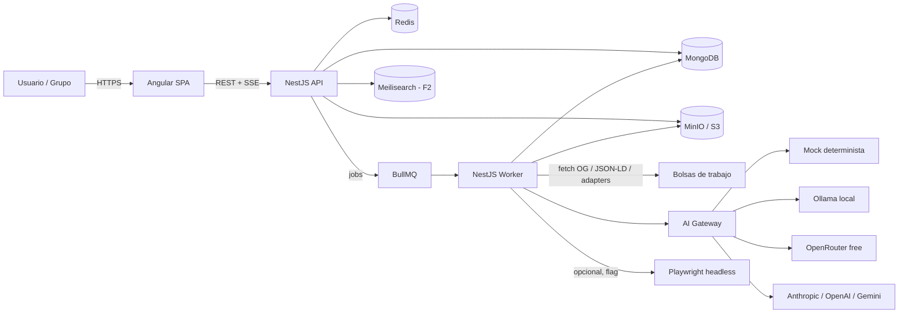
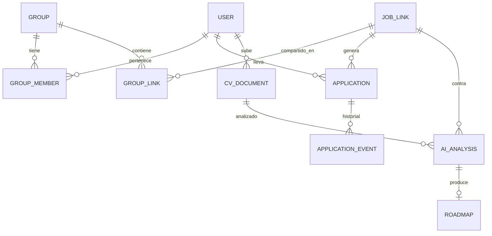
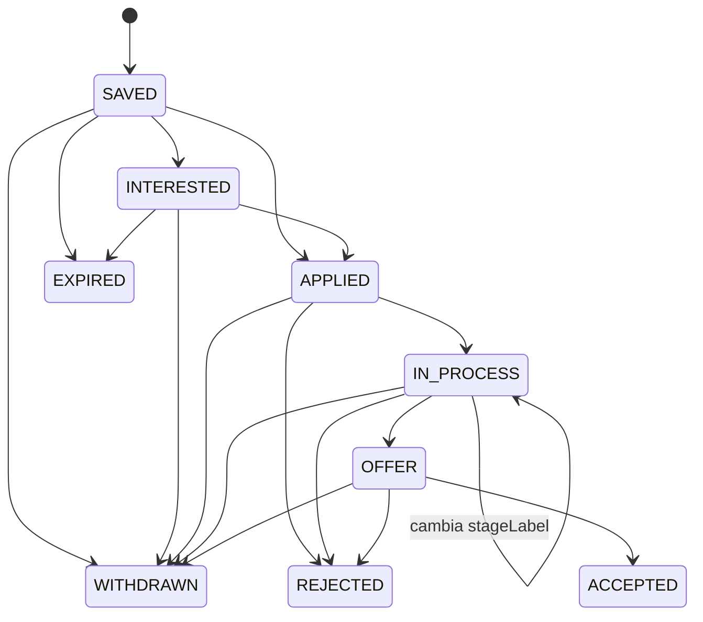
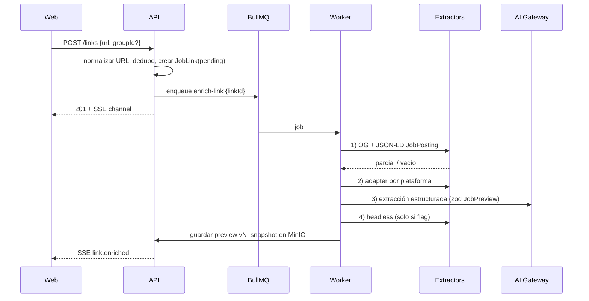
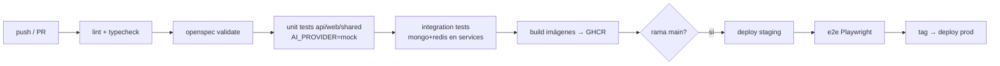

# LinkVault — Repositorio colaborativo de vacantes
## Diseño de solución + Kick-off para Claude Code (SDD con OpenSpec)

> Versión 0.1 · Septiembre 2026 · Nombre de trabajo: **LinkVault** (cámbialo cuando quieras)

---

## 1. Problema y visión

Compartimos vacantes por WhatsApp, Slack, correo y notas personales; los links se pierden, se duplican y nadie sabe quién postuló a qué. LinkVault es una **web app** donde cada persona tiene su cuenta, puede crear **grupos**, guardar enlaces de vacantes (visibles en el grupo o privados), ver un **preview enriquecido** de la vacante, y llevar el **estado de su postulación** de forma individual aunque el link sea compartido. Encima, con IA, compara el **CV** contra la vacante y propone **mejoras + un roadmap de estudio** con recursos.

**Principios de diseño**
1. El link es la unidad central; la postulación es *por usuario*, no por link.
2. Todo enriquecimiento (preview, IA) es **asíncrono y reintentable**; la UI nunca espera a un scraper.
3. IA **intercambiable** por configuración: mock determinista → modelos gratuitos → modelos frontera.
4. Open source de punta a punta; despliegue por contenedores desde el día 1.
5. Construcción **spec-first**: nada se codifica sin un change de OpenSpec.

---

## 2. Sesión de diseño — Group Chat + Team con Voting Pattern

Se simuló una mesa de diseño con roles especializados. Cada tema se debatió, cada rol votó (✅ a favor / ❌ en contra / ➖ abstención) y la mayoría simple decidió; el Arquitecto desempata. Los votos quedan registrados como **ADR** (Architecture Decision Record) para que Claude Code los respete.

**Equipo (agentes):**
| Rol | Foco |
|---|---|
| 🧭 PO / Producto | valor al usuario, MVP mínimo |
| 🏛️ Arquitecto | límites, clean architecture, ADRs |
| ⚙️ Backend Lead | NestJS, dominio, persistencia |
| 🎨 Frontend Lead | Angular, UX, estado |
| 🚀 DevOps / Platform | contenedores, CI/CD, observabilidad |
| 🤖 AI Engineer | conector IA, prompts, evaluación |
| 🔒 Seguridad & Legal | auth, datos personales, ToS de scraping |

### Debate 1 — Estilo arquitectónico del backend
- ⚙️ Backend: "Microservicios desde el inicio nos da aislamiento del scraper."
- 🏛️ Arquitecto: "Un equipo de 1-3 personas no amortiza la complejidad operativa. **Monolito modular** con módulos NestJS aislados por dominio y un **worker separado** para trabajos pesados. Los módulos ya quedan con fronteras para extraerse después."
- 🚀 DevOps: "Dos imágenes (api, worker) es manejable; diez no."

| Opción | 🧭 | 🏛️ | ⚙️ | 🎨 | 🚀 | 🤖 | 🔒 | Total |
|---|---|---|---|---|---|---|---|---|
| Microservicios | ❌ | ❌ | ✅ | ➖ | ❌ | ➖ | ➖ | 1-3 |
| **Monolito modular + worker** | ✅ | ✅ | ➖ | ✅ | ✅ | ✅ | ✅ | **6-0** |

**ADR-001:** Monolito modular NestJS + worker (BullMQ/Redis). Módulos = *bounded contexts*.

### Debate 2 — Modelo de datos: ¿link compartido o copia por usuario?
- 🧭 PO: "Si copio el link por usuario, pierdo la vista de grupo ('quién más está en este proceso')."
- ⚙️ Backend: "Separar **`JobLink`** (canónico, dedupe por URL normalizada) de **`Application`** (usuario × link × estado). Un link vive una vez; N usuarios tienen N aplicaciones."
- 🎨 Frontend: "Eso me permite mostrar en la card del grupo los avatares de quienes ya postularon."

| Opción | Total |
|---|---|
| Copia del link por usuario | 0-7 |
| **JobLink canónico + Application por usuario** | **7-0** |

**ADR-002:** `JobLink` canónico (dedupe por URL normalizada + hash), `Application` por usuario, `GroupLink` como relación link↔grupo con metadatos (quién compartió, comentario).

### Debate 3 — Estrategia de preview / extracción de la vacante
- 🔒 Legal: "Scraping headless de LinkedIn viola ToS y bloquea IPs. Empecemos por lo lícito."
- 🤖 AI: "Cadena de fallbacks: **Open Graph / JSON-LD `schema.org/JobPosting`** (la mayoría de bolsas lo publican) → **adaptadores por plataforma** (Computrabajo, Indeed, Trabajopolis, Bumeran, Empleos Bolivia, Get on Board, Remote OK) → **extracción con LLM** sobre el HTML/texto → **fallback headless (Playwright) opcional, tras feature-flag**."
- 🧭 PO: "Y si todo falla, el usuario **edita el preview a mano** y nadie queda bloqueado."

| Opción | Total |
|---|---|
| Headless scraping siempre | 1-6 |
| **Cadena OG/JSON-LD → adapters → LLM → headless (flag) → manual** | **7-0** |

**ADR-003:** Pipeline de enriquecimiento por etapas con `ExtractorStrategy` y snapshot versionado del preview. Headless detrás de `FEATURE_HEADLESS_EXTRACTION=false` por defecto.

### Debate 4 — Estados de postulación: fijos vs personalizables
- ⚙️ Backend: "Máquina de estados fija = reportes y comparativas consistentes."
- 🧭 PO: "Pero los usuarios quieren etapas propias ('prueba técnica', 'segunda entrevista')."
- 🏛️ Arquitecto: "**Estados canónicos + sub-etapas libres.** Transiciones validadas sobre el canónico; la etiqueta libre es metadato."

**ADR-004 (6-1):** Canónicos: `SAVED → INTERESTED → APPLIED → IN_PROCESS → OFFER → ACCEPTED`, terminales `REJECTED | WITHDRAWN | EXPIRED`. `IN_PROCESS` admite `stageLabel` libre. Cada cambio emite un `ApplicationEvent` (historial + timeline).

### Debate 5 — Conector de IA
- 🤖 AI: "Puerto `LlmProvider` con tres adaptadores desde el día 1: **`MockDeterministicProvider`** (fixtures por hash del prompt; snapshot tests), **`OllamaProvider`** (gratis, local) y **`OpenRouterProvider`** (modelos free tier). Los frontera (Anthropic / OpenAI / Gemini) son un adaptador más."
- 🔒 Seguridad: "El CV no sale a proveedores externos sin consentimiento explícito por perfil."
- ⚙️ Backend: "Salidas siempre **JSON con schema (zod)**; si el modelo no cumple, se reintenta o se degrada al mock."

**ADR-005 (7-0):** `AiModule` con `LlmProvider` + `EmbeddingProvider` como puertos; selección por `AI_PROVIDER`; prompts versionados en repo; salida estructurada validada; `MockDeterministicProvider` es el default en tests y CI.

### Debate 6 — Persistencia
**ADR-006 (7-0):** MongoDB como almacén principal (documentos ricos: previews, análisis de IA, roadmaps). Redis para colas y caché. MinIO (S3-compatible) para CVs. Meilisearch **opcional** (fase 2) para búsqueda full-text; Atlas Search / índice de texto de Mongo mientras tanto.

### Debate 7 — Frontend
**ADR-007 (7-0):** Angular estable actual (22.x), standalone components, **signals + zoneless**, rutas lazy por feature, `@ngrx/signals` (SignalStore) para estado, Angular Material + Tailwind para velocidad, Vitest para unit tests.

### Gaps detectados por el equipo (pendientes de decisión humana)
| # | Gap | Impacto | Propuesta |
|---|---|---|---|
| G1 | ¿Un usuario puede ocultar su estado al grupo? | Privacidad | Flag `visibility: group \| private` por Application |
| G2 | Vacantes que expiran o cambian | Datos obsoletos | Re-check semanal en worker; estado `EXPIRED` |
| G3 | Fuente legal de cursos para el roadmap | Legal/calidad | Catálogo curado en repo (`resources.seed.json`) + búsqueda web opcional detrás de flag |
| G4 | Notificaciones (nuevo link en grupo, cambio de estado) | Engagement | Fase 2: email + web push; en MVP solo feed in-app |
| G5 | Extensión de navegador para "guardar con un click" | Adopción | Fase 3 |
| G6 | Multi-idioma (vacantes ES/EN) | IA | Prompts bilingües; detectar idioma del posting |
| G7 | Costos de IA en producción | Ops | Cuotas por usuario + caché por hash (link, CV) |
| G8 | Importar links masivamente (pegar texto de WhatsApp) | Adopción | MVP: parser de URLs en texto plano |

---

## 3. Alcance por features

| Fase | Feature | Descripción corta |
|---|---|---|
| **MVP** | `auth` | Registro/login (email + password, JWT + refresh), perfil |
| MVP | `groups` | Crear grupo, invitar por link/código, roles owner/member |
| MVP | `links` | Guardar URL (privada o en grupo), dedupe, tags, notas, importar desde texto |
| MVP | `preview` | Enriquecimiento asíncrono (OG/JSON-LD/adapters), edición manual |
| MVP | `applications` | Estado por usuario, timeline de eventos, tablero kanban |
| MVP | `share` | Página pública de preview (`/p/:slug`) con OG tags para compartir |
| MVP | `ai-core` | AiModule con mock/Ollama/OpenRouter |
| **F2** | `cv` | Subir CV (PDF/DOCX), extracción de texto, versiones |
| F2 | `cv-match` | Gap analysis CV vs vacante, sugerencias de mejora |
| F2 | `roadmap` | Plan de estudio con recursos (cursos, posts, libros, docs) |
| F2 | `search` | Búsqueda full-text (Meilisearch) y filtros |
| F2 | `notifications` | Email/web push |
| **F3** | `discovery` | Buscar vacantes en bolsas (APIs/adapters) sin scraping agresivo — **ADR-043** / change `job-discovery` (Get on Board + Remote OK; sin boards robots-blocked). F3 construcción cerró con `demo-seed` (ADR-042); discovery es post-v1 fila 29. |
| F3 | `extension` | Extensión de navegador |
| F3 | `analytics` | Métricas personales/grupo (funnel de postulaciones) |

---

## 4. Arquitectura

### 4.1 Vista de contexto



### 4.2 Componentes de software

| Componente | Tecnología | Responsabilidad |
|---|---|---|
| `apps/web` | Angular 22, signals, Material+Tailwind | SPA, kanban, grupos, preview, CV/roadmap |
| `apps/api` | NestJS 11, Fastify adapter | REST, auth, validación, orquestación de casos de uso, SSE de progreso |
| `apps/worker` | NestJS (standalone app) + BullMQ | Enriquecimiento de links, extracción de CV, llamadas a IA, re-checks |
| `packages/shared` | TS puro | DTOs/zod schemas, enums de estados, tipos compartidos front/back |
| `packages/ai-providers` | TS puro | Adaptadores `LlmProvider` (mock, ollama, openrouter, anthropic, openai) |
| MongoDB 7 | — | Persistencia principal |
| Redis 7 | — | Colas, caché de previews, rate-limit |
| MinIO | — | CVs y snapshots HTML |
| Meilisearch (F2) | — | Búsqueda |
| Traefik / Nginx | — | Reverse proxy, TLS |
| OpenTelemetry + Pino | — | Trazas y logs; Grafana/Loki/Tempo opcional |

### 4.3 Clean Architecture en NestJS (por módulo)

```
apps/api/src/modules/applications/
├── domain/                     # sin dependencias de Nest ni Mongo
│   ├── application.entity.ts   # agregado + reglas (transiciones válidas)
│   ├── application-status.ts   # enum + máquina de estados
│   ├── events/                 # ApplicationStatusChanged, ...
│   └── ports/
│       ├── application.repository.ts   # interface (puerto de salida)
│       └── clock.ts
├── application/                # casos de uso (orquestan dominio)
│   ├── change-status.usecase.ts
│   ├── list-by-group.usecase.ts
│   └── dto/                    # comandos/queries (zod desde packages/shared)
├── infrastructure/
│   ├── persistence/mongo/
│   │   ├── application.schema.ts
│   │   └── mongo-application.repository.ts   # implementa el puerto
│   └── messaging/bull-event-publisher.ts
├── presentation/
│   ├── http/applications.controller.ts
│   └── http/mappers/
└── applications.module.ts      # cablea puertos → adaptadores con tokens
```

Reglas que Claude Code debe cumplir (van en `CLAUDE.md`):
- `domain/` **no importa** de `@nestjs/*`, `mongoose` ni de otros módulos.
- Los casos de uso dependen de **interfaces**; los adaptadores se inyectan con `{ provide: APPLICATION_REPOSITORY, useClass: MongoApplicationRepository }`.
- Comunicación entre módulos vía **eventos de dominio** (EventEmitter2 in-process; BullMQ cuando cruza al worker), nunca importando repositorios ajenos.
- Todo DTO se valida con zod (`nestjs-zod`) usando los schemas de `packages/shared`.

### 4.4 Modelo de datos (MongoDB)



Colecciones clave (campos principales):
- **users**: `email, passwordHash, displayName, avatarUrl, aiConsent{externalProviders:boolean}, createdAt`
- **groups**: `name, slug, ownerId, inviteCode, settings{defaultVisibility}`
- **group_members**: `groupId, userId, role: owner|member, joinedAt`
- **job_links**: `normalizedUrl (unique), urlHash, originalUrls[], source{platform, adapter}, preview{title, company, location, modality, salaryText, seniority, skills[], description, postedAt, expiresAt, logoUrl}, previewStatus: pending|enriched|failed|manual, previewVersion, snapshotKey, createdBy, createdAt`
- **group_links**: `groupId, linkId, sharedBy, comment, tags[], pinned, sharedAt`
- **applications**: `userId, linkId, status, stageLabel?, visibility: group|private, notes, appliedAt?, updatedAt`  — índice único `(userId, linkId)`
- **application_events**: `applicationId, from, to, stageLabel?, note, at`
- **cv_documents**: `userId, fileKey, mimeType, extractedText, version, isDefault, uploadedAt`
- **ai_analyses**: `userId, linkId, cvId, provider, model, promptVersion, inputHash, matchScore, missingSkills[], suggestions[], createdAt`
- **roadmaps**: `analysisId, items[{skill, priority, resources[{type: course|post|book|doc, title, url?, provider, free:boolean}]}]`
- **resources_catalog**: catálogo curado (seed) de cursos/libros/docs por skill.

### 4.5 Máquina de estados de postulación



### 4.6 Pipeline de enriquecimiento de un link (worker)



Cada etapa implementa `ExtractorStrategy { supports(url): boolean; extract(ctx): Promise<Partial<JobPreview>> }`; el orquestador hace **merge por confianza** y detiene la cadena cuando los campos obligatorios están completos. Rate limit por dominio y `User-Agent` identificable. Respetar `robots.txt`.

### 4.7 AI Gateway

```ts
// packages/ai-providers/src/ports.ts
export interface LlmProvider {
  readonly name: string;
  complete(req: { system: string; user: string; schema?: ZodSchema; temperature?: number }): Promise<LlmResult>;
}
export interface EmbeddingProvider { embed(texts: string[]): Promise<number[][]>; }
```

| Adaptador | Costo | Uso |
|---|---|---|
| `MockDeterministicProvider` | 0 | Tests, CI, demo offline. Responde con fixtures indexados por `sha256(promptVersion + inputHash)`; si no hay fixture, genera respuesta plantilla determinista |
| `OllamaProvider` | 0 (local) | Dev local, self-host (`llama3.x`, `qwen2.5`, `mistral`) |
| `OpenRouterProvider` | 0 (free tier) | Modelos `:free`; primer default en staging |
| `AnthropicProvider` / `OpenAIProvider` / `GeminiProvider` | pago | Producción cuando haya presupuesto |

Patrones agénticos **dentro del producto**:
- **Prompt chaining** (extraer → normalizar → clasificar skills) para el preview.
- **Routing**: tareas simples al modelo gratuito, análisis de CV al mejor disponible según `aiConsent`.
- **Evaluator–optimizer** para sugerencias de CV: un paso genera, otro critica contra la vacante y reescribe (máx. 2 iteraciones).
- **Tool use** acotado para el roadmap: `searchCatalog(skill)` sobre el catálogo curado; búsqueda web solo con flag.
- **Caché semántico**: `inputHash` de (link.previewVersion, cv.version, promptVersion) evita relanzar análisis idénticos.

Prompts en `apps/worker/src/ai/prompts/<name>.v1.md` con front-matter (`version, schema, provider hints`). Cambiar un prompt = nuevo archivo versionado + fixtures nuevos del mock.

### 4.8 CV → sugerencias → roadmap

1. Upload (PDF/DOCX ≤ 5 MB) → MinIO → job `extract-cv` (`pdf-parse`, `mammoth`).
2. `analyze-match {cvId, linkId}` → salida zod `MatchReport { score, matchedSkills, missingSkills, weakSections, suggestions[{section, before, after, rationale}] }`.
3. `build-roadmap {analysisId}` → para cada `missingSkill` prioriza (impacto × frecuencia en la vacante) y busca recursos en `resources_catalog`; completa con LLM solo donde el catálogo no cubre, marcando `verified:false`.
4. Frontend muestra diff de sugerencias (aceptar/rechazar) y roadmap por semanas, exportable a Markdown.

### 4.9 Frontend Angular — estructura

```
apps/web/src/app/
├── core/            # auth interceptor, api client, sse service, guards
├── shared/ui/       # componentes puros (link-card, status-chip, kanban-column)
├── features/
│   ├── auth/  ├── groups/  ├── links/  ├── applications/ (kanban + timeline)
│   ├── preview/ (público /p/:slug)  ├── cv/  └── roadmap/
└── state/           # SignalStores por feature (linksStore, applicationsStore)
```
Convenciones: standalone, `inject()`, `input()/output()` signals, `@if/@for`, zoneless, `provideHttpClient(withFetch())`, rutas lazy `loadChildren`, i18n ES/EN con `@angular/localize`.

---

## 5. Despliegue y CI/CD

### 5.1 Contenedores
- `docker/api.Dockerfile`, `docker/worker.Dockerfile`, `docker/web.Dockerfile` — multi-stage, `node:22-alpine`, usuario no root; HEALTHCHECK de imagen = liveness (`/health/live`), readiness en compose.prod (`/health`).
- `docker-compose.yml` (dev): web, api, worker, mongo, redis, minio, ollama (perfil `ai-local`), meilisearch (perfil `search`).
- `docker-compose.prod.yml`: + Traefik con Let's Encrypt, réplicas del worker.

### 5.2 Pipeline (GitHub Actions; equivalente en GitLab CI)


### 5.3 Alternativas de despliegue (elige por presupuesto)
| Opción | Costo aprox. | Cuándo |
|---|---|---|
| VPS (Hetzner/Contabo/DigitalOcean) + docker compose + Traefik + Watchtower | 5-10 USD/mes | MVP, control total |
| Fly.io / Railway / Render (contenedores) | free tier → bajo | Demo pública rápida, sin gestionar servidor |
| k3s en un VPS + Helm chart en `infra/helm` | igual que VPS | Cuando quieras practicar Kubernetes / escalar workers |
| Google Cloud Run + MongoDB Atlas M0 + Upstash Redis | casi 0 al inicio | Serverless por contenedor; worker como Cloud Run Job |

Observabilidad mínima: `/health`, `/metrics` (Prometheus), logs JSON con `pino`, trazas OTel exportadas a Grafana Tempo (opcional).

---

## 6. Patrones agénticos para **construir** con Claude Code

| Patrón | Cómo lo aplicamos |
|---|---|
| **Spec-Driven (OpenSpec)** | Cada feature = un *change*: `proposal.md`, `specs/*/spec.md` (deltas), `design.md`, `tasks.md`. Sin change no hay código |
| **Subagentes especializados** (`.claude/agents/`) | `architect` (solo lee y escribe specs/ADRs), `backend-dev`, `frontend-dev`, `devops`, `ai-engineer`, `qa-reviewer` (solo revisa, no edita) |
| **Group chat + voting** | Antes de `design.md` de cada change grande, se pide a Claude Code que convoque a los subagentes, debatan y voten; el resultado se pega en `design.md` como ADR |
| **Plan → Apply → Verify → Archive** | Flujo OPSX: `/opsx:new` → `/opsx:ff` → revisión humana → `/opsx:apply` → `/opsx:verify` → `/opsx:archive` |
| **Evaluator** | `qa-reviewer` revisa cada PR contra la spec y contra `CLAUDE.md` (clean architecture, tests, zod) |
| **Hooks** | `PostToolUse` ejecuta `pnpm lint && pnpm test:affected`; `Stop` corre `openspec validate` |
| **Agent Teams (paralelo)** | En changes que tocan front y back, un team con `backend-dev` y `frontend-dev` trabajando en paralelo sobre el contrato compartido de `packages/shared` |

---

## 7. Kick-off paso a paso

### 7.1 Prerrequisitos
- Node 22 LTS, pnpm 9, Docker Desktop / Podman, Git.
- Claude Code instalado y autenticado.
- `npm i -g @fission-ai/openspec@latest` (verifica con `openspec --version`).
- (Opcional) Ollama con un modelo local: `ollama pull qwen2.5:7b`.

### 7.2 Día 0 — bootstrap del repo (manual, 30 min)
```bash
mkdir linkvault && cd linkvault && git init
pnpm init && pnpm add -Dw typescript @types/node eslint prettier vitest
mkdir -p apps/api apps/web apps/worker packages/shared packages/ai-providers infra docker docs
printf 'packages:\n  - apps/*\n  - packages/*\n' > pnpm-workspace.yaml
openspec init        # elige Claude Code → crea openspec/ y los comandos /opsx:*
claude               # abre Claude Code en el repo
```

### 7.3 `CLAUDE.md` inicial (pégalo en la raíz)
```markdown
# LinkVault — reglas para Claude Code
## Flujo
- Spec-Driven con OpenSpec. NUNCA implementes sin un change activo en openspec/changes/.
- Orden: /opsx:new → /opsx:ff → esperar aprobación humana → /opsx:apply → /opsx:verify → /opsx:archive.
- Cambios de diseño relevantes → ADR en docs/adr/ADR-XXX.md (formato: contexto, opciones, votos, decisión).
## Arquitectura (ver docs/design.md)
- Monolito modular NestJS + worker BullMQ. Clean architecture por módulo: domain/ application/ infrastructure/ presentation/.
- domain/ no importa @nestjs/*, mongoose ni otros módulos. Casos de uso dependen de interfaces (ports) inyectadas por tokens.
- Contratos y enums compartidos viven en packages/shared (zod). Front y back importan de ahí.
- IA solo a través de LlmProvider (packages/ai-providers). Default en tests/CI: AI_PROVIDER=mock.
- Prompts versionados en apps/worker/src/ai/prompts/*.vN.md. Cambiar prompt = nueva versión + fixtures del mock.
## Calidad
- Tests: vitest. Cada caso de uso con test unitario (repositorio en memoria). Integración con mongo/redis vía testcontainers.
- pnpm lint && pnpm typecheck && pnpm test deben pasar antes de dar por terminada una tarea.
- Commits convencionales (feat:, fix:, spec:, chore:). Un change de OpenSpec ≈ un PR.
## Frontend
- Angular 22 standalone, signals, zoneless, SignalStore. Sin NgModules. Sin any.
## Seguridad
- Nunca loguear tokens ni contenido de CV. Scraping: respetar robots.txt, sin headless salvo FEATURE_HEADLESS_EXTRACTION=true.
```

### 7.4 Subagentes (`.claude/agents/*.md`)
Crea uno por rol de la §2. Ejemplo mínimo:
```markdown
---
name: architect
description: Diseña y revisa límites de módulos, ADRs y specs de OpenSpec. No escribe código de producción.
tools: Read, Grep, Glob, Write
---
Eres el arquitecto de LinkVault. Aplica clean architecture y los ADRs de docs/adr/. Cuando te convoquen a un debate de diseño, expone opciones con trade-offs, vota y desempata. Escribe la decisión en design.md del change activo.
```
Repite para `backend-dev` (Read/Edit/Write/Bash), `frontend-dev`, `devops`, `ai-engineer`, `qa-reviewer` (solo Read/Grep/Glob).

### 7.5 Primer prompt en Claude Code (sesión de diseño con voting)
```
Lee docs/design.md (este documento). Convoca a los subagentes architect, backend-dev, frontend-dev,
devops, ai-engineer y qa-reviewer como un group chat. Debatan y voten los ADR-001..007 y los gaps G1..G8.
Si algún voto cambia una decisión, documenta por qué en docs/adr/. Luego crea el proyecto en OpenSpec:
/opsx:new bootstrap-monorepo
```

### 7.6 Secuencia de changes de OpenSpec (Sprint 0–2)
| Orden | Change | Contenido | Agente principal |
|---|---|---|---|
| 1 | `bootstrap-monorepo` | pnpm workspaces, NestJS api+worker, Angular web, packages/shared, lint, vitest, docker-compose dev, CI básico | devops |
| 2 | `ai-gateway` | ports, MockDeterministicProvider, Ollama, OpenRouter, fixtures, tests snapshot | ai-engineer |
| 3 | `auth-users` | registro/login, JWT+refresh, guards, perfil | backend-dev + frontend-dev |
| 4 | `groups` | CRUD grupo, invitación por código, roles | backend + frontend |
| 5 | `job-links` | normalización URL, dedupe, JobLink, GroupLink, importar desde texto | backend + frontend |
| 6 | `link-enrichment` | worker, cola, ExtractorStrategy (OG/JSON-LD, 3 adapters, LLM), SSE | backend + ai |
| 7 | `applications-tracking` | máquina de estados, eventos, kanban, timeline | backend + frontend |
| 8 | `public-preview-share` | `/p/:slug` con OG tags server-rendered (Angular SSR o página estática desde API) | frontend |
| 9 | `cv-upload-extract` | MinIO, pdf-parse/mammoth, versiones | backend |
| 10 | `cv-match-suggestions` | MatchReport, evaluator-optimizer, UI de diff | ai + frontend |
| 11 | `study-roadmap` | catálogo curado, generación, export Markdown | ai + frontend |
| 12 | `deploy-prod` | compose prod + Traefik, pipeline CD, alternativas documentadas | devops |

Para cada change: `/opsx:new <nombre>` → `/opsx:ff` → revisas `proposal.md`, `specs/`, `design.md`, `tasks.md` → `/opsx:apply` → `/opsx:verify` → PR → `/opsx:archive`.

### 7.7 Definition of Done (por change)
- Spec delta mergeada en `openspec/specs/`.
- Casos de uso con tests unitarios; endpoints con test de integración; componente clave con test.
- `AI_PROVIDER=mock` pasa en CI; fixtures actualizados si cambió un prompt.
- `docker compose up` levanta la feature end-to-end.
- ADR escrito si hubo decisión no trivial.

### 7.8 Variables de entorno (referencia)
```
MONGO_URI=mongodb://mongo:27017/linkvault
REDIS_URL=redis://redis:6379
S3_ENDPOINT=http://minio:9000  S3_BUCKET=cv  S3_ACCESS_KEY=...  S3_SECRET_KEY=...
JWT_SECRET=...  JWT_REFRESH_SECRET=...
AI_PROVIDER=mock | ollama | openrouter | anthropic | openai
OLLAMA_URL=http://ollama:11434  OLLAMA_MODEL=qwen2.5:7b
OPENROUTER_API_KEY=...  OPENROUTER_MODEL=<modelo>:free
FEATURE_HEADLESS_EXTRACTION=false
FEATURE_WEB_SEARCH_ROADMAP=false
```

---

## 8. Riesgos y mitigaciones

| Riesgo | Mitigación |
|---|---|
| Bloqueo/ToS de bolsas de trabajo | Cadena de extracción lícita primero; headless por flag; edición manual siempre disponible |
| Calidad variable de modelos gratuitos | Salidas con schema zod + reintento + degradación al mock; caché por hash |
| Sobre-ingeniería temprana | Monolito modular; Meilisearch/notificaciones/extension en fases posteriores |
| Datos sensibles en CV | Consentimiento por perfil para proveedores externos; cifrado en reposo en MinIO; retención configurable |
| Drift entre spec y código | `openspec validate` en CI; `qa-reviewer` compara PR vs spec |

---

## 9. Próximos pasos inmediatos
1. Ajusta nombre, alcance MVP y resuelve G1–G3 (son los que afectan al modelo de datos).
2. Ejecuta §7.2 y guarda este documento como `docs/design.md`.
3. Lanza el prompt de §7.5 y revisa el resultado de la votación antes de `bootstrap-monorepo`.
4. Primer objetivo demostrable (≈2 semanas): pegar un link en un grupo, ver el preview enriquecido y mover la postulación en el kanban, todo con `AI_PROVIDER=mock`.
